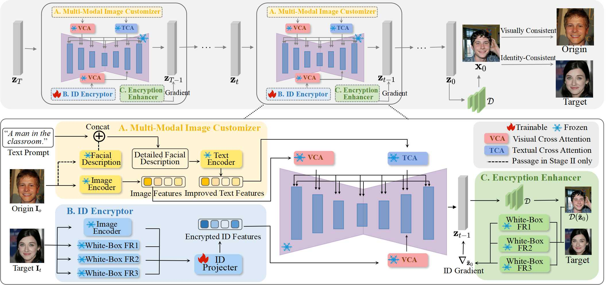

<div align="center">


  
  <h1>Adv-CPG: A Customized Portrait Generation Framework with Facial Adversarial Attacks</h1>
  
_How to generate a safe customized portrait?_

  <div>
      <a>Junying Wang</a><sup>1</sup>,
      <a>Hongyuan Zhang</a><sup>2,3</sup>,
      <a href="https://iopen.nwpu.edu.cn/info/1015/4866.htm" target="_blank">Yuan Yuan</a><sup>1</sup><sup>#</sup>
  </div>

  <div>
  <sup>1</sup>School of AI, OPtics and ElectroNics (iOPEN), Northwestern Polytechnical University, 
  </div>   
  <div>
  <sup>2</sup>The University of Hong Kong, <sup>3</sup>Institute of Artificial Intelligence (TeleAI), China Telecom
  </div> 
<div>
 <sup>#</sup>Corresponding author. 
   </div>
<div>
  
</div>
   
  <a href="https://openaccess.thecvf.com/content/CVPR2025/html/Wang_Adv-CPG_A_Customized_Portrait_Generation_Framework_with_Facial_Adversarial_Attacks_CVPR_2025_paper.html"><strong>Paper</strong></a> |
<a href="https://github.com/JunyingWang959/Adv-CPG"><strong>Github</strong></a> 
  <div style="width: 100%; text-align: center; margin:auto;">
      
  </div>

  The overall framework of the proposed **Adv-CPG**. The framework comprises three key modules: [A] a multi-modal image
customizer (MMIC), [B] an ID encryptor (En1), and [C] an encryption enhancer (En2). En1 and En2 enable incremental facial privacy
protection, and MMIC achieves fine-grained and personalized portrait generation.

<div align="left">
    
### Infer
```setup
python infer_adv_cpg.py
```
    
## Thanks

The code for this work builds upon **ConsistentID**. We sincerely thank them for their excellent work; please visit their <a href="https://github.com/JackAILab/ConsistentID"><strong>project page</strong></a>  for more details. 
Please maintain the same environment configuration as theirs and directly run infer_adv.py to execute this work.

  ## Citation
If you found this code helpful, please consider citing:
~~~
@InProceedings{Wang_2025_CVPR,
    author    = {Wang, Junying and Zhang, Hongyuan and Yuan, Yuan},
    title     = {Adv-CPG: A Customized Portrait Generation Framework with Facial Adversarial Attacks},
    booktitle = {Proceedings of the Computer Vision and Pattern Recognition Conference (CVPR)},
    month     = {June},
    year      = {2025},
    pages     = {21001-21010}
}
~~~


